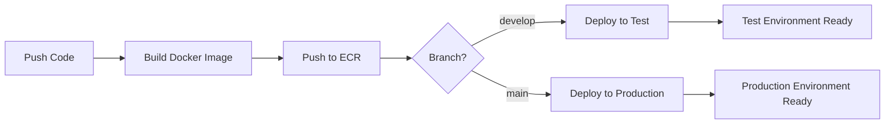

# 🚀 Guide de Déploiement Kubernetes - Hotel Management

Ce guide vous explique comment déployer votre application Django Hotel Management sur AWS avec Kubernetes, en gérant deux environnements : **Test** et **Production**.

## 📋 Table des Matières

1. [Architecture](#architecture)
2. [Prérequis](#prérequis)
3. [Configuration AWS](#configuration-aws)
4. [Déploiement](#déploiement)
5. [Gestion des Environnements](#gestion-des-environnements)
6. [Monitoring et Maintenance](#monitoring-et-maintenance)
7. [Dépannage](#dépannage)

## 🏗️ Architecture

### Structure des Fichiers Kubernetes

```
k8s/
├── base/                          # Configuration de base (commune)
│   ├── kustomization.yaml
│   ├── namespace.yaml
│   ├── configmap.yaml
│   ├── secret.yaml
│   ├── deployment.yaml
│   ├── service.yaml
│   ├── ingress.yaml
│   └── hpa.yaml
└── environments/
    ├── test/                      # Configuration spécifique au test
    │   ├── kustomization.yaml
    │   ├── deployment-patch.yaml
    │   ├── ingress-patch.yaml
    │   └── hpa-patch.yaml
    └── prod/                      # Configuration spécifique à la production
        ├── kustomization.yaml
        ├── deployment-patch.yaml
        ├── ingress-patch.yaml
        ├── hpa-patch.yaml
        ├── postgres-deployment.yaml
        ├── postgres-service.yaml
        └── secrets.env
```

### Environnements

| Environnement | Namespace | Domaine | Base de données | Répliques |
|---------------|-----------|---------|-----------------|-----------|
| **Test** | `hotel-management-test` | `test-hotel.yourdomain.com` | SQLite | 1-3 |
| **Production** | `hotel-management-prod` | `hotel.yourdomain.com` | PostgreSQL | 3-20 |

## 🔧 Prérequis

### Outils Requis

1. **AWS CLI** - Pour interagir avec AWS
2. **eksctl** - Pour gérer les clusters EKS
3. **kubectl** - Pour gérer Kubernetes
4. **Docker** - Pour construire les images
5. **Kustomize** - Pour la gestion des configurations

### Comptes et Accès

- Compte AWS avec permissions EKS, ECR, EC2
- Repository GitHub avec Actions activées
- Nom de domaine pour les environnements

## ⚙️ Configuration AWS

### 1. Exécuter le Script d'Infrastructure

```bash
# Rendre le script exécutable
chmod +x scripts/setup-aws-infrastructure.sh

# Exécuter le script
./scripts/setup-aws-infrastructure.sh
```

Ce script va créer :
- 2 clusters EKS (test et production)
- Repository ECR pour les images Docker
- NGINX Ingress Controller
- cert-manager pour les certificats SSL

### 2. Configurer les Secrets GitHub

Dans votre repository GitHub, allez dans **Settings > Secrets and variables > Actions** et ajoutez :

```
AWS_ACCESS_KEY_ID=votre-access-key
AWS_SECRET_ACCESS_KEY=votre-secret-key
```

### 3. Configurer les Domaines

Modifiez les fichiers suivants avec vos vrais domaines :

- `k8s/environments/test/ingress-patch.yaml`
- `k8s/environments/prod/ingress-patch.yaml`

### 4. Configurer les Secrets de Production

Éditez `k8s/environments/prod/secrets.env` :

```bash
# Générer une clé secrète Django
python -c "from django.core.management.utils import get_random_secret_key; print(get_random_secret_key())"

# Éditer le fichier
DJANGO_SECRET_KEY=votre-clé-générée
DB_PASSWORD=mot-de-passe-postgresql-sécurisé
AWS_ACCESS_KEY_ID=votre-access-key
AWS_SECRET_ACCESS_KEY=votre-secret-key
```

## 🚀 Déploiement

### Déploiement Automatique (Recommandé)

Le déploiement se fait automatiquement via GitHub Actions :

1. **Environnement Test** : Push sur la branche `develop`
2. **Environnement Production** : Push sur la branche `main`

### Workflow de Déploiement



### Déploiement Manuel

Si vous voulez déployer manuellement :

```bash
# Pour l'environnement de test
cd k8s/environments/test
kustomize build . | kubectl apply -f -

# Pour l'environnement de production
cd k8s/environments/prod
kustomize build . | kubectl apply -f -
```

### Test Local

Pour tester localement avant le déploiement :

```bash
# Déployer en test local
./scripts/deploy-local.sh test

# Déployer en prod local
./scripts/deploy-local.sh prod
```

## 🌍 Gestion des Environnements

### Environnement de Test

**Caractéristiques :**
- 1 réplique par défaut
- Auto-scaling : 1-3 pods
- Base de données SQLite
- Ressources limitées (300m CPU, 256Mi RAM)
- Debug activé

**Accès :**
```bash
# Voir les pods
kubectl get pods -n hotel-management-test

# Voir les logs
kubectl logs -f deployment/test-hotel-management-app -n hotel-management-test

# Port-forward pour accès local
kubectl port-forward service/test-hotel-management-service 8080:80 -n hotel-management-test
```

### Environnement de Production

**Caractéristiques :**
- 3 répliques par défaut
- Auto-scaling : 3-20 pods
- Base de données PostgreSQL dédiée
- Ressources importantes (1000m CPU, 1Gi RAM)
- Debug désactivé
- Rate limiting activé

**Accès :**
```bash
# Voir les pods
kubectl get pods -n hotel-management-prod

# Voir les logs
kubectl logs -f deployment/prod-hotel-management-app -n hotel-management-prod

# Exécuter des migrations
kubectl exec -n hotel-management-prod deployment/prod-hotel-management-app -- python manage.py migrate
```

## 📊 Monitoring et Maintenance

### Commandes Utiles

```bash
# Voir l'état des déploiements
kubectl get deployments -A

# Voir l'utilisation des ressources
kubectl top pods -A

# Voir les événements
kubectl get events -A --sort-by='.lastTimestamp'

# Redémarrer un déploiement
kubectl rollout restart deployment/prod-hotel-management-app -n hotel-management-prod
```

### Scaling Manuel

```bash
# Scaler manuellement
kubectl scale deployment prod-hotel-management-app --replicas=5 -n hotel-management-prod

# Voir l'auto-scaling
kubectl get hpa -A
```

### Mise à Jour

Les mises à jour se font automatiquement via le pipeline CI/CD. Pour une mise à jour manuelle :

```bash
# Mettre à jour l'image
kubectl set image deployment/prod-hotel-management-app django-app=nouveau-tag -n hotel-management-prod

# Suivre le rollout
kubectl rollout status deployment/prod-hotel-management-app -n hotel-management-prod
```

## 🔧 Dépannage

### Problèmes Courants

#### 1. Pods en CrashLoopBackOff

```bash
# Voir les logs détaillés
kubectl describe pod <pod-name> -n <namespace>
kubectl logs <pod-name> -n <namespace> --previous
```

#### 2. Problèmes de Base de Données

```bash
# Vérifier la connectivité PostgreSQL
kubectl exec -it deployment/prod-hotel-management-app -n hotel-management-prod -- python manage.py dbshell

# Exécuter les migrations
kubectl exec -it deployment/prod-hotel-management-app -n hotel-management-prod -- python manage.py migrate
```

#### 3. Problèmes d'Ingress

```bash
# Vérifier l'ingress
kubectl get ingress -A
kubectl describe ingress prod-hotel-management-ingress -n hotel-management-prod

# Vérifier les certificats
kubectl get certificates -A
```

#### 4. Problèmes de Ressources

```bash
# Voir l'utilisation des ressources
kubectl top nodes
kubectl top pods -A

# Voir les limites de ressources
kubectl describe nodes
```

### Rollback

En cas de problème, vous pouvez revenir à la version précédente :

```bash
# Voir l'historique des déploiements
kubectl rollout history deployment/prod-hotel-management-app -n hotel-management-prod

# Rollback à la version précédente
kubectl rollout undo deployment/prod-hotel-management-app -n hotel-management-prod
```

## 🔐 Sécurité

### Bonnes Pratiques

1. **Secrets** : Ne jamais commiter les secrets dans Git
2. **RBAC** : Utiliser les rôles Kubernetes appropriés
3. **Network Policies** : Limiter la communication entre pods
4. **Image Scanning** : Scanner les images pour les vulnérabilités
5. **Updates** : Maintenir Kubernetes et les images à jour

### Gestion des Secrets

```bash
# Créer un secret manuellement
kubectl create secret generic my-secret --from-literal=key=value -n hotel-management-prod

# Voir les secrets
kubectl get secrets -A

# Éditer un secret
kubectl edit secret prod-hotel-management-secrets -n hotel-management-prod
```

## 📞 Support

En cas de problème :

1. Vérifiez les logs des pods
2. Consultez les événements Kubernetes
3. Vérifiez la documentation AWS EKS
4. Consultez la communauté Kubernetes

---

**🎉 Félicitations !** Votre application Django Hotel Management est maintenant déployée sur Kubernetes avec AWS EKS, avec une gestion complète des environnements de test et de production. 